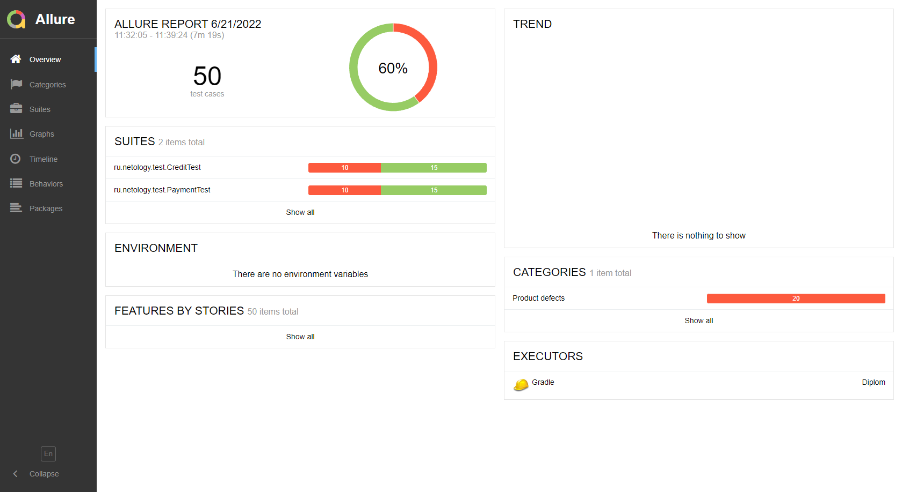
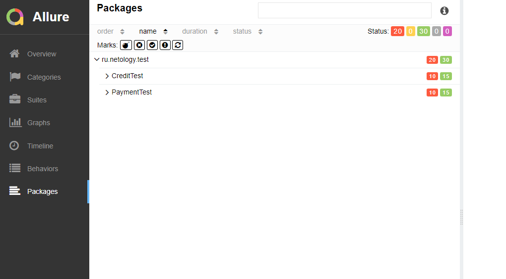
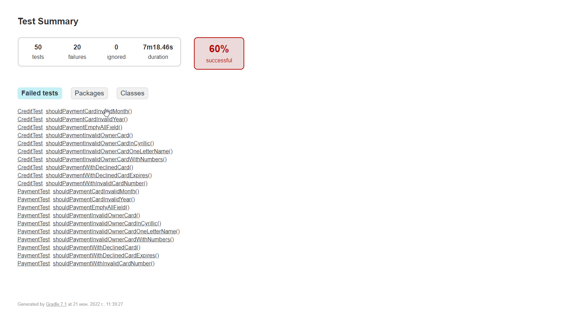
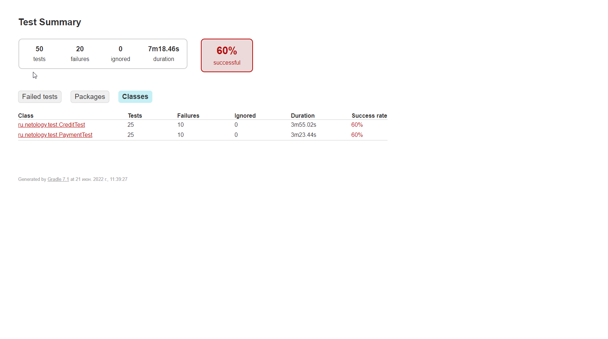

# Отчёт о проведённом тестировании
*Краткое описание*

При работе над проектом проведено тестирование веб-сервиса покупки путешествия "Путешествие дня".

1. Проведено исследовательское тестирование сервиса для ознакомления с его работой.

2. Осуществлено автоматизированное тестирование (позитивных и негативных сценариев):

* Взаимодействие веб-сервиса с базой данных.

* Автоматизированное тестирование API.

* Автоматизированное UI-тестирование веб-сервиса.

*Заявлена поддержка веб-сервисом двух СУБД:*

**PostgreSQL**

**MySQL**

|                   | Количество тест-кейсов | Количество	в процентах |
|------------------ |------------------------|------------------------|
| Всего тест-кейсов | 111                    | 100%                   | 
|    Позитивных     | 		          21         | 18.92%                 |
|    Негативных	    | 90                     | 	     81.08%           |
|   Всего успешных  | 		75                   | 67.56%                 |
|  Всего неуспешных	| 36                     | 	     32.44%           | 

*Общие рекомендации*

+ Необходима качественная техническая документация сервиса.

+ Желательно создание более информативных ошибок для полей ввода во время внесения невалидных значений вместо постоянного отображения "Неверный формат".

+ Целесообразно добавить элементам страницы сервиса data-test-* атрибуты для надежности локаторов и упрощения их поиска.

 Все результаты: